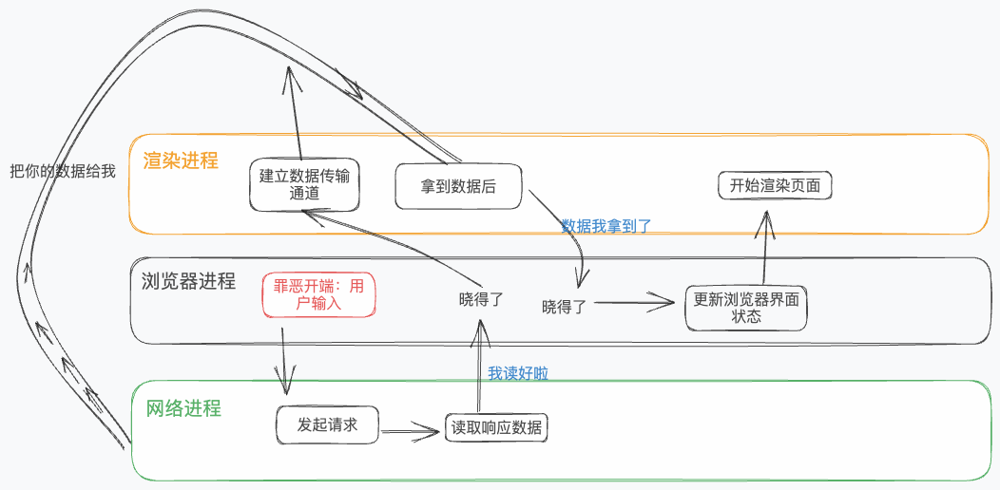

---
group:
  title: 其他
  order: 8
title: 从输入URL到页面展示，这中间发生了什么
---

# 从输入 URL 到页面展示，这中间发生了什么？

## 进程与线程

打开一个页面，在任务管理器中看到许多进程

那么进程和线程是什么关系呢？我将进程比喻作工厂，线程就是工厂中的流水线。工厂可以选择同时开启多条流水线来处理订单——称为多线程并行处理。

这其中有许多特点需要注意：

- (线程与进程)：一条线程奔溃，整个进程都会奔溃；多个线程共享进程的数据。
- (进程之间)：进程之间不共享数据，但是可以通过一些机制通信。

## HTTP 请求

HTTP 是一种允许浏览器向服务器获取资源的协议，是 Web 的基础。

在了解 HTTP 请求具体步骤前，需要先了解 HTTP 请求报文格式。

| 请求行     |                  |     |          |
| ---------- | ---------------- | --- | -------- |
|            | 请求方法         | URL | 版本协议 |
| **请求头** |                  |     |          |
|            | 头部字段名       | 值  |          |
|            | 头部字段名       | 值  |          |
|            | ....             |     |          |
| **请求体** |                  |     |          |
|            | 一些携带数据.... |     |          |

> 例子：
>
> 请求行：GET /list HTTP/1.1
>
> 请求头：
>
> Accept-Encoding：gzip, deflate, br
>
> Accept-Language：zh-CN,zh;q=0.9
>
> Content-Length：563
>
> Content-Type：application/json

浏览器端向服务器发起 HTTP 请求的步骤:

- 首先构建请求行，服务器将通过请求行来得到浏览器的请求方法（POST/GET/....）、请求 URL、以及请求的协议版本。

- 在真正发送请求前，浏览器会先在浏览器缓存中查找是否有要请求的文件。当有时，浏览器会直接返回该副本的缓存资源，截断请求。

  > 第二次打开网站会快点的原因之一。

- 根据目标 IP 和端口号来查找要访问的服务器地址。但是只有域名信息，所以需要 IP 与域名的映射关系，即 DNS 域名解析。经过解析后，找到目标地址。同样，浏览器也会缓存解析结果。等到下一次访问相同域名时，就可以直接从缓存中取。

  > 第二次打开网站会快点的原因之二。

- 建立 TCP 连接（因为只是简要了解，这里就不做详细介绍）

- 发送 HTTP 请求，将 HTTP 请求报文发送至服务器。

- 服务器接受到 HTTP 请求报文并处理结束，返回响应报文。和请求报文一样，分为响应行（版本协议、状态码）、响应头、响应体。其中处理结果是由状态码来告诉浏览器。

- 断开 TCP 连接。

这是一个普通的 HTTP 请求步骤，当然并不是全部。有时需要重定向，以及持久保持 TCP 连接。这些都是需求的拓展。

简要介绍了进程/线程、HTTP 请求步骤，就可以开始解答 **从输入 URL 到页面展示，这中间发生了什么？**

## 从输入 URL 到页面展示，这中间发生了什么？

其中最需要关注的几个进程为浏览器进程、渲染进程、网络进程（Network Service）。

基于步骤，绘画了一张步骤草图。

- 首先浏览器会根据输入的内容，合成完整的 URL。(不考虑搜索关键字情况)

- 接下来进入到页面资源请求阶段（默认请求的资源是 HTML）。浏览器进程会通知网络进程发起网络请求，那就到了上面讨论的 HTTP 请求步骤。

- 在开启渲染进程前，会先检查其他渲染进程是否可以复用（如果请求的资源是同一域名下就可复用）。

- 响应数据处理完毕后，浏览器进程会通知渲染进程和网络进程建立数据通道。渲染进程拿完数据后会通知浏览器进程更新浏览器界面状态，包括了安全状态、地址栏的 URL、前进后退的历史状态，并更新 Web 页面。

  > 这也是为什么在输入 url 回车后还在原页面停留了一下，等一会才更新页面。

- 最后，渲染进程开始渲染页面。
